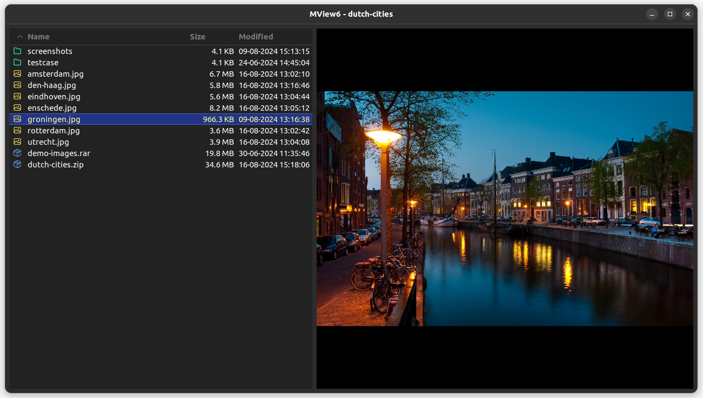
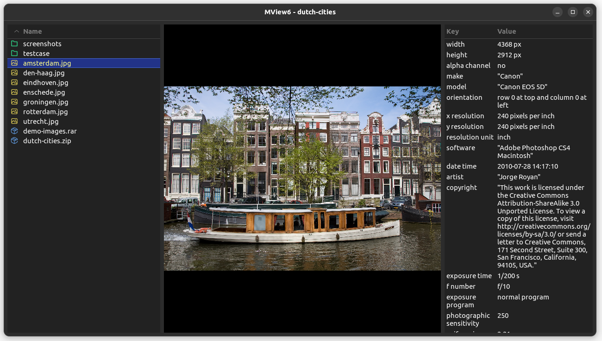
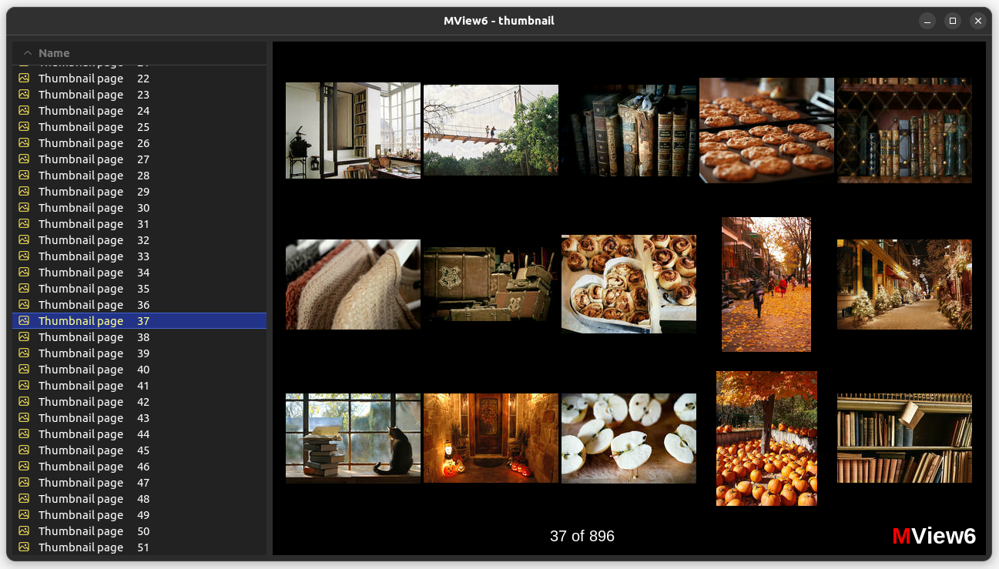

# MView6

Opiniated image browser written in Rust and GTK4





## Features

- Folder and archive browser
- View images inside zip and rar archives
- Supports most image formats including (animated) webp
- Image rotation
- Full keyboard navigation
- Convenient zoom mode presets
- Intuitive mouse / mouse-wheel zooming
- Thumbnail view, multiple thumbnail sizes
- Image information, including exif
- Tagging images as favorites or trash
- Hopping between sub-directories and archives while viewing

## Help

Press <kbd>h</kbd> for help. Press <kbd>h</kbd> again for the second help page.

## Navigation

| Key(s)                                                  | Function                                                 |
| ------------------------------------------------------- | -------------------------------------------------------- |
| <kbd>home</kbd>                                         | first image                                              |
| <kbd>end</kbd>                                          | last image                                               |
| <kbd>z</kbd> _or_ <kbd>←</kbd> _or_ <kbd>keypad 4</kbd> | previous image                                           |
| <kbd>x</kbd> _or_ <kbd>→</kbd> _or_ <kbd>keypad 6</kbd> | next image                                               |
| <kbd>↑</kbd> _or_ <kbd>keypad 8</kbd>                   | previous 5 images                                        |
| <kbd>↓</kbd> _or_ <kbd>keypad 2</kbd>                   | next 5 images                                            |
| <kbd>page up</kbd>                                      | previous 25 images                                       |
| <kbd>page down</kbd>                                    | next 25 images                                           |
| <kbd>a</kbd>                                            | previous __favorite__ image                              |
| <kbd>s</kbd>                                            | next __favorite__ image                                  |
| <kbd>w</kbd> _or_ <kbd>keypad 7</kbd>                   | hop to previous folder/archive                           |
| <kbd>e</kbd> _or_ <kbd>keypad 9</kbd>                   | hop to next folder/archive                               |
| <kbd>enter</kbd> _or_ <kbd>keypad enter</kbd>           | enter (open) folder/archive                              |
| <kbd>backspace</kbd> _or_ <kbd>keypad del</kbd>         | leave (close) folder/archive and return to parent folder |

---

What is hopping?

If you have several containers (archives or sub-folders) in a parent-folder, and you are browsing in one of the
containers, hopping allows you to go the previous or next container without exiting the
current, navigation in the parent and opening the previous or next container.

## Sort file list

Click on the table headers or use the following keys

| Key(s)                          | Function                                               |
| ------------------------------- | ------------------------------------------------------ |
| <kbd>1</kbd>                    | sort on category (folder/archive/image/favorite/trash) |
| <kbd>2</kbd>                    | sort on name                                           |
| <kbd>3</kbd>                    | sort on size                                           |
| <kbd>4</kbd>                    | sort on date                                           |

## Thumbnails

| Key(s)       | Function                      |
| ------------ | ----------------------------- |
| <kbd>t</kbd> | open thumbnail view           |
| <kbd>m</kbd> | cycle through thumbnail sizes |

## Bookmarks, (exif) information, full screen and exit

| Key(s)                                    | Function                                    |
| ----------------------------------------- | ------------------------------------------- |
| <kbd>q</kbd>                              | quit application                            |
| <kbd>d</kbd>                              | show bookmarks (edit in configuration file) |
| <kbd>f</kbd> _or_ <kbd>keypad *</kbd>     | toggle full screen                          |
| <kbd>esc</kbd>                            | exit full screen                            |
| <kbd>i</kbd>                              | toggle image information                    |
| <kbd>space</kbd> _or_ <kbd>keypad /</kbd> | toggle folder/archive view                  |

Example config file (location $HOME/.config/mview/mview6.json)

```json
{
  "bookmarks": [
    {
      "name": "Home folder",
      "folder": "/home/martin"
    },
    {
      "name": "Pictures folder",
      "folder": "/home/martin/Pictures"
    },
    {
      "name": "Holiday 2024",
      "folder": "/home/martin/holiday_2024.zip"
    }
  ]
}
```

## Rotate image

The rotation is not saved to image.

| Key(s)             | Function               |
| ------------------ | ---------------------- |
| <kbd>r</kbd>       | rotate clock-wise      |
| <kbd>shift r</kbd> | rotate anti-clock-wise |

## Zoom

Zoom using mouse and mouse wheel, or use the following keys:

| Key(s)                                | Function                                  |
| ------------------------------------- | ----------------------------------------- |
| <kbd>n</kbd>                          | toggle between `no-zoom` and `zoom-fit`   |
| <kbd>m</kbd> _or_ <kbd>keypad 0</kbd> | toggle between `zoom-fill` and `zoom-max` |

Zoom modes explained

| Mode        | Behavior                                                                                                                              |
| ----------- | ------------------------------------------------------------------------------------------------------------------------------------- |
| `no_zoom`   | Will show image 1:1, may fall outside window                                                                                          |
| `zoom_fit`  | Will not enlarge image, but will make sure it fits in the window by shrinking it when necessairy                                      |
| `zoom_fill` | Will shrink or enlarge image to fill the available window area. All of the image will be visible, there may be black margins          |
| `zoom_max`  | Will shrink or enlarge image to fill the available window area. There will be no black margins, part of the image may fall off-screen |

## Marking images as "favorite" or "trash"

| Key(s)                                | Function                                    |
| ------------------------------------- | ------------------------------------------- |
| <kbd>=</kbd> _or_ <kbd>keypad +</kbd> | mark image as favorite (or unmark as trash) |
| <kbd>-</kbd> _or_ <kbd>keypad -</kbd> | mark image as trash (or unmark as favorite) |

Marking is done by adding `.lo.` or `.hi.` to the image filename. For example `image_123.jpg` will be renamed to `image_123.hi.jpg`. This does currently not work inside zip or rar archives.

## Building

```shell
cargo build --release
```

Put the executable `./target/release/MView6` somewhere in your path.

## Requirements

The following libraries have to be installed

### Ubuntu

```shell
sudo apt-get install libglib2.0-dev libgdk-pixbuf-2.0-dev libgraphene-1.0-dev libgtk-4-dev librsvg2-dev
```

### MacOS

```shell
brew install pkg-config cairo gtk4
```
